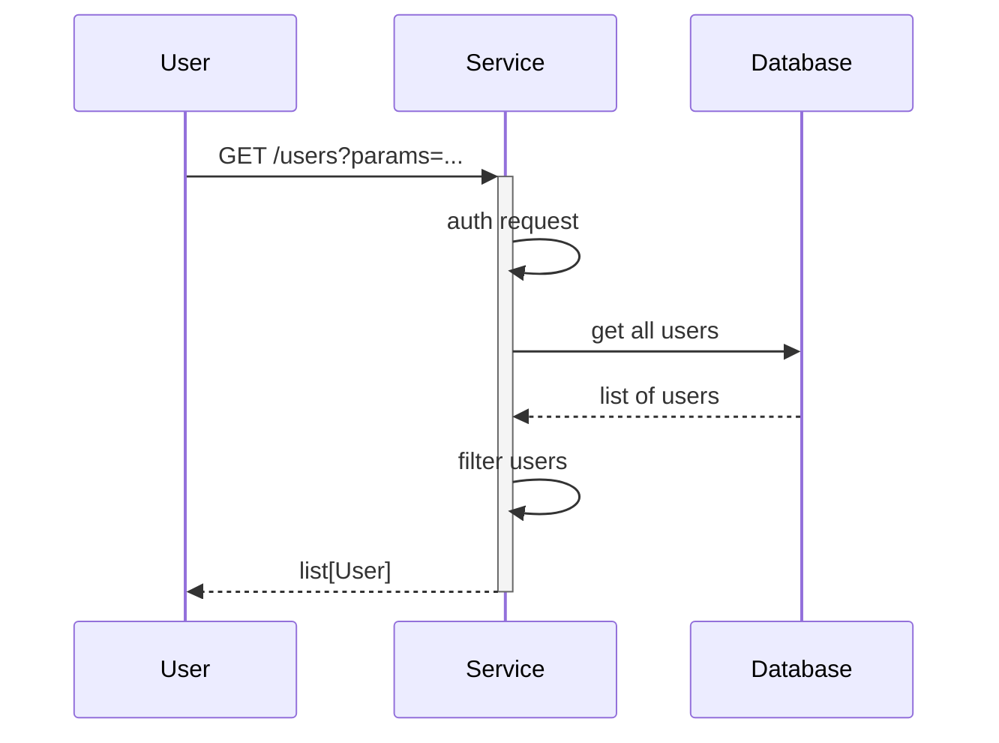

# NHS Notify Reporting

[](https://github.com/NHSDigital/nhs-notify-reporting/actions/workflows/cicd-1-pull-request.yaml)
[](https://sonarcloud.io/summary/new_code?id=NHSDigital_nhs-notify-reporting)

This repository contains code for the reporting domain of the NHS Notify system.

The reporting domain provides an isolated environment for staging data used for reporting purposes, such as exposure of data to Power BI.

This allows appropriate views of data to be safely exposed without sharing the full contents of the underlying transactional database.

This domain does not contain any application code. The reporting domain is built exclusively through AWS services, incorporating the following technologies:

- [AWS Step Functions](https://docs.aws.amazon.com/step-functions/latest/dg/welcome.html)
- [AWS Glue](https://docs.aws.amazon.com/glue/latest/dg/what-is-glue.html)
- [AWS Athena](https://docs.aws.amazon.com/athena/latest/ug/what-is.html)
- [AWS S3](https://docs.aws.amazon.com/AmazonS3/latest/userguide/Welcome.html)
- [Apache Iceberg](https://iceberg.apache.org/)

## Table of Contents

- [NHS Notify Repository Template](#nhs-notify-reporting)
  - [Table of Contents](#table-of-contents)
  - [Documentation](#documentation)
  - [Setup](#setup)
    - [Prerequisites](#prerequisites)
  - [Usage](#usage)
    - [Testing](#testing)
  - [Design](#design)
    - [Diagrams](#diagrams)
    - [Modularity](#modularity)
  - [Contributing](#contributing)
  - [Contacts](#contacts)
  - [Licence](#licence)

## Documentation

- [Built](/)
- [Source](/docs/README.md)

## Setup

Clone the repository

```shell
git clone https://github.com/NHSDigital/nhs-notify-reporting.git
cd nhs-notify-reporting
```

### Prerequisites

In order to facilitate cross-account export of data, the reporting domain requires IAM permissions for the Glue Catalogue and underlying S3 storage to be setup in the NHS Notify core account.

## Usage

After successful deployment, the following will be available:

  - Staging tables for each data view/projection.
  - Athena saved queries to incrementally populate the staging tables from the core account.
  - A step function to periodically execute the saved ingestion queries.

The step function and saved queries can be executed manually as required. They are idempotent, so can be executed outside of the scehduled execution without harm.

### Testing

As there is no application code, testing of ingestion queries is currently performed manually.

## Design

### Diagrams

The [C4 model](https://c4model.com/) is a simple and intuitive way to create software architecture diagrams that are clear, consistent, scalable and most importantly collaborative. This should result in documenting all the system interfaces, external dependencies and integration points.


The source for diagrams should be in Git for change control and review purposes. Recommendations are [draw.io](https://app.diagrams.net/) (example above in [docs](.docs/diagrams/) folder) and [Mermaids](https://github.com/mermaid-js/mermaid). Here is an example Mermaids sequence diagram:



### Modularity

Most of the projects are built with customisability and extendability in mind. At a minimum, this can be achieved by implementing service level configuration options and settings. The intention of this section is to show how this can be used. If the system processes data, you could mention here for example how the input is prepared for testing - anonymised, synthetic or live data.

## Contributing

Describe or link templates on how to raise an issue, feature request or make a contribution to the codebase. Reference the other documentation files, like

- Environment setup for contribution, i.e. `CONTRIBUTING.md`
- Coding standards, branching, linting, practices for development and testing
- Release process, versioning, changelog
- Backlog, board, roadmap, ways of working
- High-level requirements, guiding principles, decision records, etc.

## Contacts

Email the NHS Notify team at <england.nhsnotify@nhs.net>

## Licence

See [LICENCE.md](./LICENCE.md)

Any HTML or Markdown documentation is [© Crown Copyright](https://www.nationalarchives.gov.uk/information-management/re-using-public-sector-information/uk-government-licensing-framework/crown-copyright/) and available under the terms of the [Open Government Licence v3.0](https://www.nationalarchives.gov.uk/doc/open-government-licence/version/3/).
